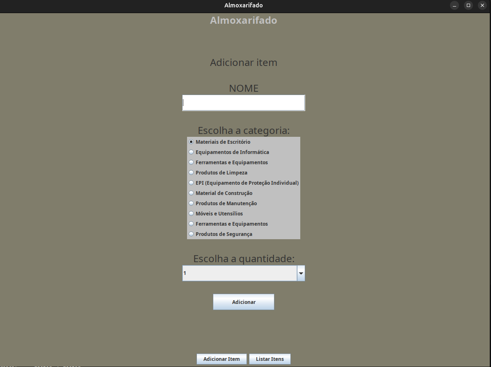
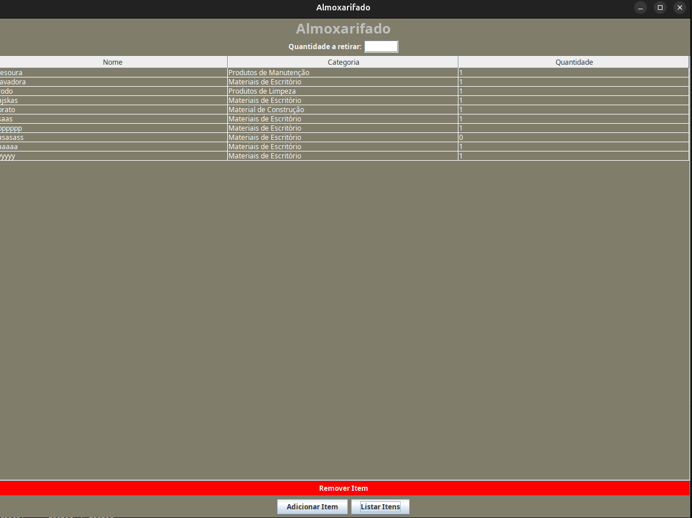

# Project Name

A simple system developed for learning purposes. While it follows some programming shortcuts, it is **fully functional** and serves as an example of my ability to build a working application from scratch.

<p align="center">
  
  
</p>


## About the Project

This project was created **purely for educational purposes** and to test my skills in software development. Some aspects of the code can be improved, making it a great exercise in refactoring and applying best practices.

Despite these areas for improvement, the project is **functional and can be easily enhanced** to follow better coding standards.

## Features

- Item registration with available quantity in stock.
- Item withdrawal registration, automatically decrementing the available quantity.
- Simple interface to add and remove items.
- Basic stock control system.

## Technologies Used

- Java, MySQL.

## Why This Project?

This project was built **to practice and demonstrate my ability to develop a complete system**. It serves as a **foundation for improvement** and could be refactored to follow clean code principles and best practices.

## If You Want to Use This

### Prerequisites
- Java 21 or later installed
- Maven installed
- MySQL installed and running

### Build the Project
1. Navigate to the root directory of the project.
2. Run the following command to build the project:
   ```sh
   mvn package
   ```

### Database Setup
1. Open MySQL and create a new database named `estoque`:
   ```sh
   mysql -u root -p
   ```
   ```sql
   CREATE DATABASE estoque;
   ```
2. Create a table named `produtos` with the necessary columns:
   ```sql
   USE estoque;
   CREATE TABLE produtos (
       id INT AUTO_INCREMENT PRIMARY KEY,
       nome VARCHAR(255) NOT NULL,
       categoria VARCHAR(255) NOT NULL,
       quantidade INT NOT NULL
   );
   `````


### Configure Database Credentials (Optional)
If you need to change the database credentials, modify the `db` class in the source code and update the database URL, username, and password accordingly.

### Run the Application
1. After building the project, find the generated JAR file using:
   ```sh
   ls target/*.jar
   ```
2. Run the application using:
   ```sh
   java -jar target/your-application.jar
   ```
   Replace `your-application.jar` with the actual name of the generated JAR file.
   or:
      ```sh
   java -jar target/almox-1.0-SNAPSHOT-jar-with-dependencies.jar
   ```

Now, the system should be up and running!

## Future Improvements

- Refactoring to improve code structure and maintainability.
- Implementing design patterns for better organization.
- Enhancing the interface for better user experience.

## Disclaimer

⚠ **This is NOT a production-ready system.** It was created as a learning experience and should not be used in real-world applications without proper refactoring.

## Contact

If you have any suggestions or feedback, contact me!

📧 Email: gabrielnobresantiago123@gmail.com